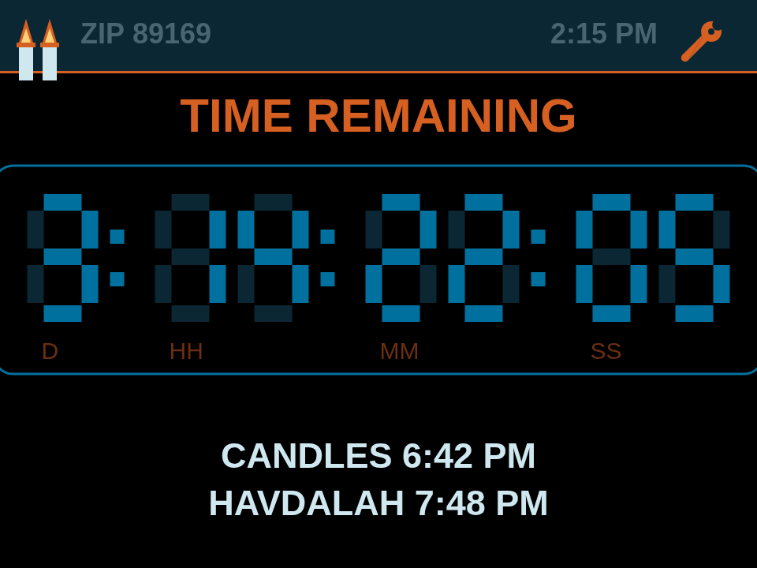

# Shabbat Countdown — CYD + Web Flasher

This is a shabbat candle-lighting/havdalah countdown clock using  the **CYD** ("Cheap Yellow Display", Sunton ESP32-2432S028R) plus a browser-based flasher, so anyone with the right board can flash it.



*A mockup of the on-device UI mid-week, showing the days/hours/minutes/seconds
remaining until candle-lighting, the ShabbatCon blue/orange color scheme, and
the header's ZIP code + live clock.*

## Layout

```
shabbat_countdown_cyd/
  shabbat_countdown_cyd.ino   ← the CYD-adapted sketch (same folder/file
                                 name is required by Arduino's convention)
web-flasher/
  index.html                  ← the flasher page (uses esp-web-tools)
  manifest.json                ← tells the flasher which files go where
  firmware/                    ← compiled binaries — filled in by CI, not
                                 committed by hand
.github/workflows/
  build-firmware.yml          ← compiles the sketch and updates
                                 web-flasher/firmware/ on every push
```

## Flashing a device

Open the Pages URL in **Chrome or Edge on a desktop** (Web Serial isn't
available elsewhere), plug the CYD in over USB, click **Connect & Flash**,
pick the serial port, and follow the prompts. It erases and writes the
whole flash, so it works on a totally blank board too.

## Wi-Fi credentials

Both sketches now have a **Settings → WI-FI** screen with an on-device
keyboard: tap it, enter your network name and password, and they're saved
to that device's own flash (`Preferences`) — never compiled into the
firmware. `WIFI_SSID`/`WIFI_PASS` in the .ino are only a fallback default
used the very first time a device boots with nothing saved yet.

This means the firmware built for the public web flasher never needs a
real Wi-Fi password baked into it — anyone can flash the same public
binary and then type in their own network on the touchscreen afterward,
same as setting up any commercial smart-home gadget. The device sits on a
"WI-FI NOT SET UP — tap the wrench to configure" screen until you do.

## Touch calibration

Resistive touch panels vary a bit unit to unit. If taps land off-target on
your specific board, flip `TOUCH_DEBUG` to `1` near the top of the touch
driver code, reflash, tap a few known points, and adjust
`TS_MINX`/`TS_MAXX`/`TS_MINY`/`TS_MAXY` — and if X/Y come out swapped or
inverted, adjust the two `map()` calls in `getTouchPoint()`
